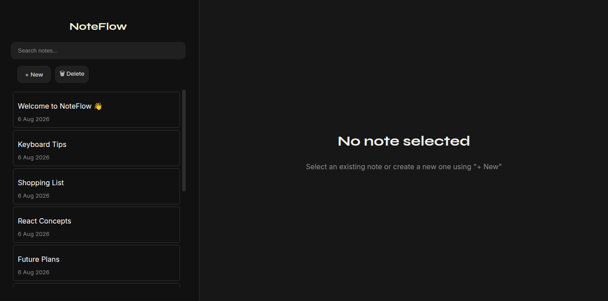
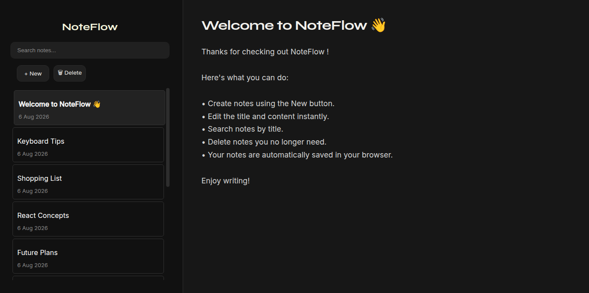

# NoteFlow

>A clean and minimal note-taking application built with React and Vite. A personal project built while learning React to practice CRUD operations, state management, Local Storage, and component-based architecture.

**Status:** ✅ Completed (Version 1)

## Screenshot

### Empty State



### Welcome Note



## 📚 What I Learned

- React component architecture
- State management using `useState`
- Side effects using `useEffect`
- Lazy state initialization
- Browser Local Storage
- CRUD operations
- Search functionality
- CSS Flexbox layouts

## ✨ Features

A lightweight note-taking application with persistent local storage and instant search.

- Create new notes
- Edit note titles and content
- Instant search by title
- Delete notes
- Automatic Local Storage persistence
- Clean dark-themed UI

## 🛠️ Tech Stack

- React
- JavaScript (ES6+)
- CSS
- Vite

## 🙏 Acknowledgements

Built as part of my React learning journey.

## 🚀 Getting Started

Clone the repository and install dependencies:

```bash
git clone https://github.com/Buvanesh2008/noteflow.git
cd noteflow
npm install
npm run dev
```

## 🔮 Future Improvements

- Pin notes
- Tags and categories
- Theme customization
- Responsive mobile layout
- Backend integration with Express & MongoDB

